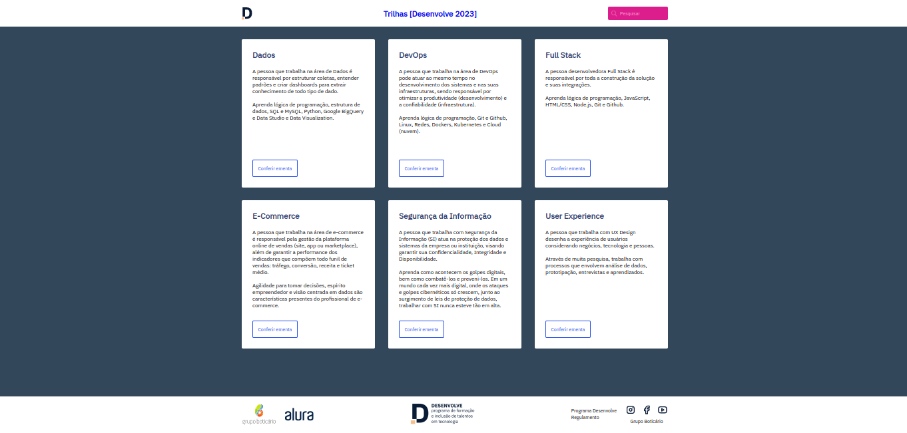

<h1 style='font-weight: 300'><strong>Desafio Trilhas [Desenvolve 2023]</strong> - Projeto educacional</h1>

Projeto proposto pela Alura durante o programa Desenvolve 2023 do Grupo Boticário.  

  <a href="#-tecnologias">Tecnologias</a>&nbsp;&nbsp;&nbsp;|&nbsp;&nbsp;&nbsp;
  <a href="#-projeto">Projeto</a>&nbsp;&nbsp;&nbsp;|&nbsp;&nbsp;&nbsp;
  <a href="#-layout">Layout</a>&nbsp;&nbsp;&nbsp;

 

## 🛠 Tecnologias

- HTML
- CSS

## 💻 Projeto

Página com informações sobre as trilhas disponíveis no Programa Desenvolve 2023 do Grupo Boticário.

- [Visite o projeto online](https://ellendutra.github.io/trilhas-desenvolve)
